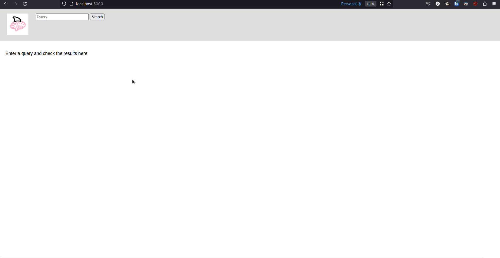

# RecallFin

<p align="center">
  
</p>

RecallFin is a lightweight, privacy-focused tool that automatically indexes
content you consume, so that you can search it later, acting as a powerful
extension for your memory.

# Features
- **Privacy-focused** - Everything is stored locally and never leaves your machine
- **Simple** - No fancy AI stuff, just OCR, SQLite and HTML.
- **Full-text search** - Allows you to perform a fast full-text search across all the content you've consumed
- **AFK Detection** - Detects when you barely scrolled or are AFK and saves disk space
- **Context View** - Allows you to recall a capture and see what you were doing around that time window, even if that was 8 months ago

# Showcase


# How it works

RecallFin works by having an agent running that will periodically take a
screenshot, convert its content into text and then save both the image and the
text locally, using SQLite's `fts5` in order to index and query data.

The web interface allows the user to query his data, inspect specific captures
and get a *context view* of it, that shows the previous and next 2 captures to
the selected capture, allowing the user to travel the timeline.

# Installation and Usage

## Using Nix
```sh
nix develop
python3 recallfin.py --interval 10 & # start the agent in background
python3 web.py # start the web interface (port 5000)
```

## Other distros
- TODO

# TODO:
- [x] Create logo and name for the project
- [x] Add license
- [x] Group by date when listing entries
- [ ] Support temporal queries
- [ ] Support spell correction using sqlite's spellfix1 extension
- [ ] Add a requirements.txt and document non-nix installation
- [ ] Improve OCR techniques
- [x] Improve CLI interface
- [ ] Tag captures based on visible hyperlinks
